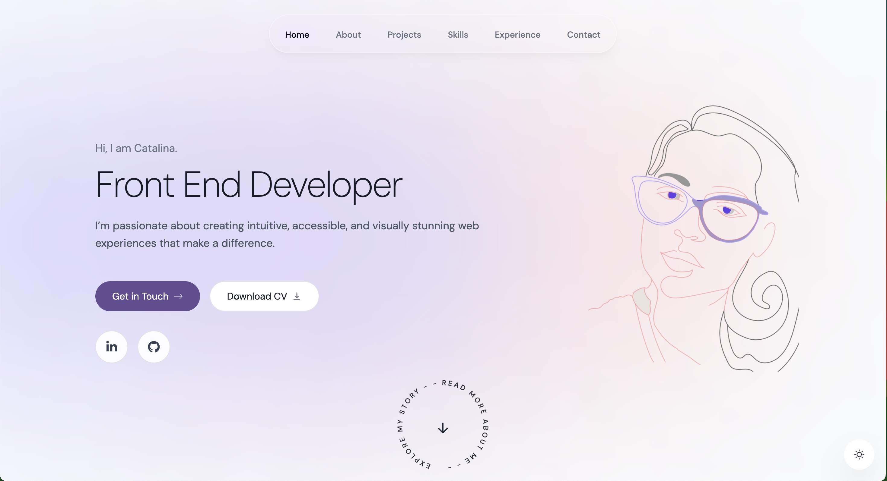
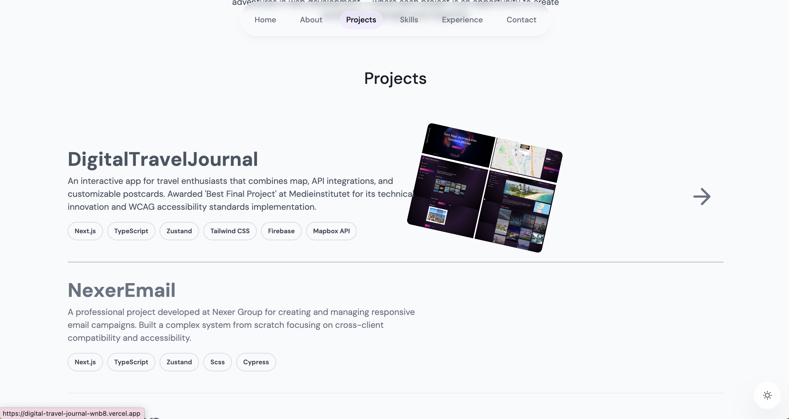

# My Portfolio Website

A modern, responsive portfolio website showcasing my projects and professional experience as a frontend developer.

  
    
      
     

## Live Demo

[View my portfolio website](https://catavadani-portfolio-nextjs.vercel.app/)

## Features

- Modern UI with responsive design for all device sizes
- Dark/Light mode theme toggle with system preference detection
- Animated page transitions and UI interactions
- Server-side rendering for improved performance and SEO
- Contact form with email delivery through Resend API
- Projects showcase
- TypeScript for type safety and code quality
- Performance optimized with Next.js App Router

## Tech Stack

- **Framework**: Next.js 14 (App Router)
- **Language**: TypeScript
- **Styling**: Tailwind CSS
- **Animations**: Framer Motion
- **Email**: React Email & Resend
- **Deployment**: Vercel

## Acknowledgements

- Design inspiration from various sources while adding my personal touch
- Tutorial foundation with significant customizations to fit my needs

